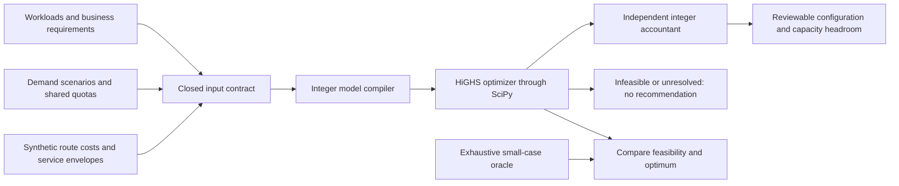

# MarTech Stack Economics

**Can we reduce integration cost without making launch-day workflows late, losing required data, or exhausting a shared API quota?**

This executable planner selects a cost-minimal integration configuration for a finite set of business workflows. It accounts for shared platform fees, partially filled batches, hourly bursts, total quotas, required data capabilities, permitted processing regions and declared freshness bounds. One configuration must work across every supplied scenario.

The business value is a defensible architecture decision: which workflows should share an integration platform, which need faster routes, and when a proposed saving is infeasible. The output includes the arithmetic and rejected alternatives a platform architect can discuss with Marketing, Web, Product Marketing and integration owners.

**Start with the [executed proof](docs/evidence/report.md).** Five synthetic workflows span lead handoff, campaign suppression, attribution, web personalization and product enrichment.

| Engineering question | Executed result |
|---|---|
| Does the cheapest normal-day plan survive a campaign surge? | No. Independent accounting identifies the shared quota violations |
| What configuration satisfies both scenarios at minimum modeled cost? | Streaming for three time-sensitive workflows; bulk for two slower workflows |
| How is the optimum checked? | Independent enumeration of all **3,125 configurations** agrees with the MILP solver |
| Can the budget be one cent below the optimum? | No feasible plan; a named constraint conflict is retained |
| Does shrinking capacity merely slow the same architecture? | The optimal configuration changes; at 30 CRM requests/hour, none is feasible |

The example's optimum is **782 cents** versus **1,340 cents** for its feasible all-premium reference over a four-hour horizon. This is arithmetic on deliberately synthetic prices and demand—not a vendor benchmark, forecast or realized saving. The precise figures matter as reproducible checks, not as a commercial ROI claim.

## Why this adds to the portfolio

My four existing public architecture projects cover governed execution, agent evaluation, temporal audience correctness and migration assurance. This project adds **constrained stack economics and capacity planning**: determining which integration configuration meets business requirements at the lowest modeled cost. It complements those implementations rather than duplicating another control plane, campaign agent, audience engine or migration tool. [Architecture decision and comparison](docs/decision.md).



## Run it

Use Python **3.12**, from the extracted repository root:

```bash
python -m venv .venv
# Activate .venv for your shell.
python -m pip install -r requirements.lock
python -m pip install --no-deps --no-build-isolation -e .
python scripts/verify.py
```

Verification runs lint, dependency checks, automated tests, independent optimum comparisons and the asserted demonstration, then regenerates source-bound evidence. No API key, model download, cloud account, database or Docker engine is needed.

For an individual decision:

```bash
stack-economics solve fixtures/campaign-launch.json --output work/plan.json
stack-economics check fixtures/campaign-launch.json --plan work/plan.json --output work/check.json
```

`check` recomputes feasibility and accounting and rejects changed assumptions or implementation. It does **not** independently reprove a saved plan's optimality. `solve` establishes the solver optimum and checks the selected configuration independently. [Commands and exit codes](docs/operations.md).

## What is implemented and verified

- **Joint configuration selection:** shared fixed fees are charged once per enabled platform, not once per workflow. Choices cannot change between scenarios.
- **Integer request accounting:** a partial batch consumes a whole request; zero records consume no requests. Hourly and total quotas are both enforced.
- **Hard business constraints:** price cannot override required deletion/field support, permitted regions or freshness bounds.
- **Bounded failure behavior:** infeasible, solver-limited, solver-error and independently rejected results contain no recommendation. Infeasibility explanations distinguish a fully reduced conflict from an unfinished reduction.
- **Independent checks:** a separate integer accountant never imports the compiler; exhaustive enumeration and randomized cases compare feasibility and global cost, not just a solver success flag.
- **Evidence preservation:** the demo retains overloaded and lossy cheap plans, input assumptions, resource headroom, cost lines, capacity tradeoffs and infeasible results.

Python makes the input and accounting readable. SciPy's HiGHS-backed mixed-integer solver handles the coupled discrete choices; it is appropriate where sorting routes by price fails because shared fees and quotas interact. [Architecture and mathematical contract](docs/architecture.md).

## Honest boundary

This is an independent, synthetic **offline planning system**. Route capability and latency declarations are inputs, not executed vendor integrations or measured service guarantees. Capacity is modeled per hour and per horizon; within-hour queues, network timing, live scheduling, probabilistic demand and unmodeled outages are outside the proof. No campaign is sent and no procurement action is taken.

The executed environment is local Windows with Python, NumPy and SciPy. CI is supplied for Windows and Ubuntu; **hosted CI for this new repository has not been observed**. Existing repositories' successful workflow statuses do not establish this project's CI result.

[Actual validation and limitations](docs/validation.md) · [Generated test/environment record](docs/evidence/verification.json) · [Presentation and handoff](docs/handoff.md)
